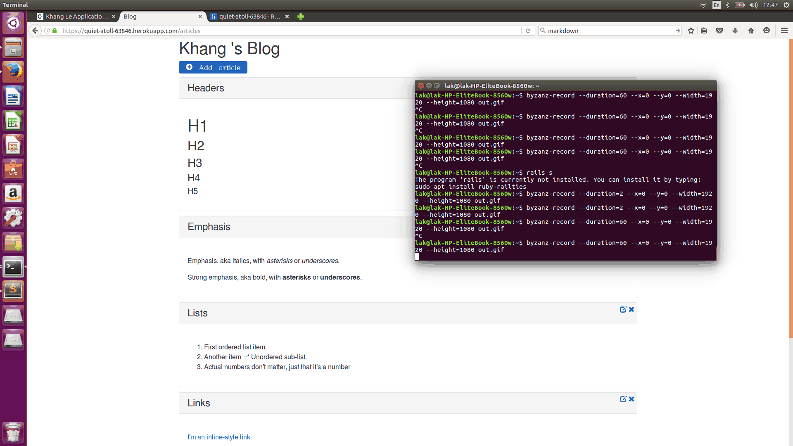

# The first RoR application

This is the first RoR application for Ruby on Rails submitted.

Time spent: 8 hours

Completed:

* [x] Required: Application can create, update and view all articles in blog
* [x] Additional: I already added pagination function for the page. Each page just have 5 records. 
* [x] Additional: Add more function : remove article
* [x] Additional: Change style for button, message
* [x] Additional: Validate input data with title & body

Issues:

* [x] The first time to develop on Ubuntu, it takes me 4 hours just for first step : create demo with database. THis page https://gorails.com/setup/ubuntu/14.10 helped me a lot.
* [x] The solution was to change config.assets.compile = false to config.assets.compile = true in the config/environments/production.rb file help me to show icon on the server
* [x] The first time to work with github

GIF created with [Byzanz](https://wiki.ubuntu.com/CreatingScreencasts).
